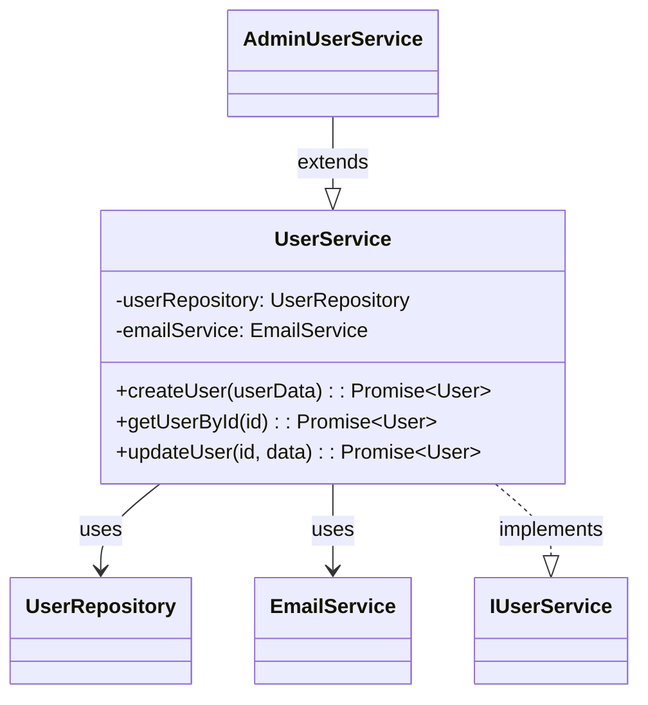

# 🧜‍♀️ business-mermaid-mcp

> language: [English](./README.md) | **Korean**

MCP 호환 AI 도구(Claude Desktop, Cursor 등)에서 코드로부터 Mermaid UML 다이어그램을 생성합니다.

## 개요

mermaid-mcp는 TypeScript/JavaScript 코드베이스를 분석하고 아름다운 Mermaid 다이어그램을 생성하는 모델 컨텍스트 프로토콜(MCP) 서버입니다. 현재는 상속, 합성, 인터페이스, 사용 패턴을 포함한 클래스 관계의 자동 발견 기능을 가진 **클래스 다이어그램**에 중점을 두고 있습니다.

**🚀 곧 출시 예정**: 플로우 다이어그램, 임포트 맵, 시퀀스 다이어그램 등!

## 기능

### 현재 기능 (클래스 다이어그램)

-   **스마트 클래스 탐지**: 코드베이스에서 대상 클래스를 자동으로 찾습니다
-   **관계 분석**: 상속, 합성, 인터페이스 구현, 사용 관계를 탐지합니다
-   **Mermaid 클래스 다이어그램 생성**: AI를 사용하여 깔끔하고 전문적인 UML 클래스 다이어그램을 생성합니다
-   **다중 언어 지원**: TypeScript, JavaScript, JSX, TSX 파일과 함께 작동합니다
-   **구성 가능한 깊이**: 분석 깊이를 제어하고 특정 관계 유형을 포함/제외할 수 있습니다
-   **스마트 필터링**: 기본적으로 테스트 파일, 빌드 아티팩트, node_modules를 제외합니다
-   **AI 기반**: OpenAI 또는 Anthropic 모델을 사용하여 지능적인 다이어그램 생성을 제공합니다

### 계획된 기능

-   **플로우 차트**: 함수 호출 흐름과 실행 경로를 시각화합니다
-   **임포트 맵**: 모듈 의존성과 임포트 관계를 보여줍니다
-   **시퀀스 다이어그램**: 메소드 상호작용과 API 흐름을 표시합니다

## 설치

```bash
npm install -g mermaid-mcp
```

## 구성

### 환경 변수

다이어그램 생성을 위해 LLM 제공자(OpenAI 또는 Anthropic)를 구성해야 합니다:

#### OpenAI의 경우:

```bash
export MCP_LLM_PROVIDER="openai"
export OPENAI_API_KEY="your-openai-api-key"
export MCP_LLM_MODEL="gpt-4o-mini"
```

#### Anthropic의 경우:

```bash
export MCP_LLM_PROVIDER="anthropic"
export ANTHROPIC_API_KEY="your-anthropic-api-key"
export MCP_LLM_MODEL="claude-3-5-sonnet-20241022"
```

### Claude Desktop 통합

Claude Desktop의 `claude_desktop_config.json`에 추가하세요:

```json
{
    "mcpServers": {
        "mermaid-mcp": {
            "command": "npx",
            "args": [
                "-y",
                "mermaid-mcp"
            ],
            "env": {
                "MCP_LLM_PROVIDER": "anthropic",
                "ANTHROPIC_API_KEY": "your-api-key-here",
                "MCP_LLM_MODEL": "claude-3-5-sonnet-20241022"
            }
        }
    }
}
```

## 사용법

### 기본 클래스 다이어그램 생성

```
내 프로젝트에서 "UserService" 클래스의 클래스 다이어그램을 생성해주세요
```

### 고급 옵션

이 도구는 다양한 구성 옵션을 지원합니다:

-   **`targetClass`** (필수): 분석할 클래스의 이름
-   **`projectPath`** (선택): 프로젝트 디렉토리의 절대 경로 (VS Code에서 자동 감지)
-   **`depth`** (1-10, 기본값: 1): 분석할 관계 깊이
-   **`includeInterfaces`** (기본값: true): 인터페이스 구현을 포함
-   **`includeComposes`** (기본값: false): 합성 관계를 포함
-   **`includeUsages`** (기본값: true): 대상을 확장하는 클래스들을 포함
-   **`includePrivate`** (기본값: false): private 멤버들을 포함
-   **`excludePatterns`**: 파일을 제외하는 글롭 패턴
-   **`language`** (기본값: 'en'): 프롬프트와 출력 언어 ('en', 'ko')

### 출력 예시



## 지원되는 관계

-   **상속** (`extends`): 대상 클래스를 확장하는 자식 클래스
-   **인터페이스 구현** (`implements`): 대상 클래스가 구현하는 인터페이스
-   **합성**: private/protected 필드나 생성자 매개변수로 사용되는 클래스
-   **사용**: 메소드 시그니처나 public 속성에서 참조되는 클래스

## 프로젝트 구조 지원

-   ✅ `tsconfig.json`이 있는 TypeScript 프로젝트
-   ✅ `tsconfig.json`이 없는 JavaScript 프로젝트
-   ✅ 혼합 TS/JS 프로젝트
-   ✅ 모노레포 및 복잡한 프로젝트 구조

## 파일 제외

기본적으로 다음을 제외합니다:

-   `**/test/**`, `**/spec/**`, `**/__tests__/**`
-   `**/*.test.*`, `**/*.spec.*`
-   `**/stories/**` (Storybook)
-   `node_modules`, `.git`, `dist`, `build`

## 기여하기

1. 저장소를 포크하세요
2. 기능 브랜치를 생성하세요 (`git checkout -b feature/amazing-feature`)
3. 변경사항을 커밋하세요 (`git commit -m 'Add some amazing feature'`)
4. 브랜치에 푸시하세요 (`git push origin feature/amazing-feature`)
5. Pull Request를 생성하세요

## 라이센스

MIT

## 문제 해결

### 일반적인 문제들

**"Class not found in project"**

-   클래스 이름이 올바르게 철자되어 있고 코드베이스에 존재하는지 확인하세요
-   파일이 기본 패턴에 의해 제외되지 않았는지 확인하세요

**"LLM configuration error"**

-   API 키가 올바르게 설정되었는지 확인하세요
-   제공자와 모델이 지원되는지 확인하세요

**"Failed to analyze child classes with ts-morph"**

-   이는 일반적으로 `tsconfig.json`이 누락되거나 유효하지 않을 때 발생합니다
-   이 경우 도구는 기본 분석으로 돌아갑니다

### 로드맵 (2025.09)

- [ ] 배포 설정
- [ ] 확장성 고려한 리팩터링
- [ ] 임포트 맵 추가
