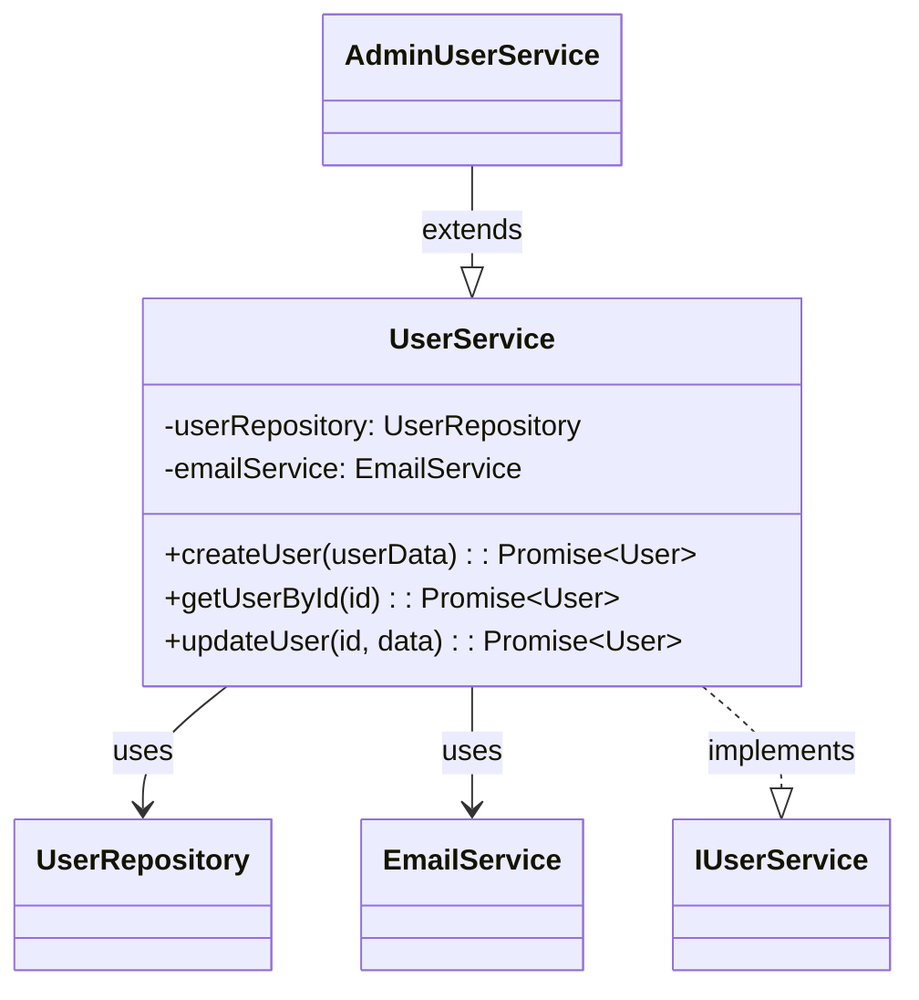

# 🧜‍♀️ business-mermaid-mcp

> language: **English** | [Korean](./README.ko.md)

Generate Mermaid UML diagrams from code in any MCP-compatible AI tool (Claude Desktop, Cursor, etc.)

## Overview

mermaid-mcp is a Model Context Protocol (MCP) server that analyzes your TypeScript/JavaScript codebase and generates beautiful Mermaid diagrams. Currently focused on **class diagrams** with automatic discovery of class relationships including inheritance, composition, interfaces, and usage patterns.

**🚀 Coming Soon**: Flow diagrams, import maps, sequence diagrams, and more!

## Features

### Current (Class Diagrams)

-   **Smart Class Discovery**: Automatically finds target classes in your codebase
-   **Relationship Analysis**: Detects inheritance, composition, interface implementation, and usage relationships
-   **Mermaid Class Diagram Generation**: Creates clean, professional UML class diagrams using AI
-   **Multi-language Support**: Works with TypeScript, JavaScript (JSX, and TSX files soon)
-   **Configurable Depth**: Control analysis depth and include/exclude specific relationship types
-   **Smart Filtering**: Excludes test files, build artifacts, and node_modules by default
-   **AI-Powered**: Uses OpenAI or Anthropic models for intelligent diagram generation

### Planned Features

-   **Flow Charts**: Visualize function call flows and execution paths
-   **Import Maps**: Show module dependencies and import relationships
-   **Sequence Diagrams**: Display method interactions and API flows

## Installation

```bash
npm install -g mermaid-mcp
```

## Configuration

### Environment Variables

You need to configure an LLM provider (OpenAI or Anthropic) for diagram generation:

#### For OpenAI:

```bash
export MCP_LLM_PROVIDER="openai"
export OPENAI_API_KEY="your-openai-api-key"
export MCP_LLM_MODEL="gpt-4o-mini"
```

#### For Anthropic:

```bash
export MCP_LLM_PROVIDER="anthropic"
export ANTHROPIC_API_KEY="your-anthropic-api-key"
export MCP_LLM_MODEL="claude-3-5-sonnet-20241022"
```

### Claude Desktop Integration

Add to your Claude Desktop `claude_desktop_config.json`:

```json
{
    "mcpServers": {
        "mermaid-mcp": {
            "command": "npx",
            "args": [
                "-y",
                "mermaid-mcp"
            ],
            "env": {
                "MCP_LLM_PROVIDER": "anthropic",
                "ANTHROPIC_API_KEY": "your-api-key-here",
                "MCP_LLM_MODEL": "claude-3-5-sonnet-20241022"
            }
        }
    }
}
```

## Usage

### Basic Class Diagram Generation

```
Generate a class diagram for the "UserService" class in my project
```

### Advanced Options

The tool supports various configuration options:

-   **`targetClass`** (required): Name of the class to analyze
-   **`projectPath`** (optional): Absolute path to project directory (auto-detected in VS Code)
-   **`depth`** (1-10, default: 1): Relationship depth to analyze
-   **`includeInterfaces`** (default: true): Include interface implementations
-   **`includeComposes`** (default: false): Include composition relationships
-   **`includeUsages`** (default: true): Include classes that extend the target
-   **`includePrivate`** (default: false): Include private members
-   **`excludePatterns`**: Glob patterns to exclude files
-   **`language`** (default: 'en'): Language for prompts and output ('en', 'ko')


### Example Output



## Supported Relationships

-   **Inheritance** (`extends`): Child classes extending the target class
-   **Interface Implementation** (`implements`): Interfaces implemented by the target class
-   **Composition**: Classes used as private/protected fields or constructor parameters
-   **Usage**: Classes referenced in method signatures or public properties

## Project Structure Support

-   ✅ TypeScript projects with `tsconfig.json`
-   ✅ JavaScript projects without `tsconfig.json`
-   ✅ Mixed TS/JS projects
-   ✅ Monorepos and complex project structures

## File Exclusion

By default, excludes:

-   `**/test/**`, `**/spec/**`, `**/__tests__/**`
-   `**/*.test.*`, `**/*.spec.*`
-   `**/stories/**` (Storybook)
-   `node_modules`, `.git`, `dist`, `build`

## Contributing

1. Fork the repository
2. Create your feature branch (`git checkout -b feature/amazing-feature`)
3. Commit your changes (`git commit -m 'Add some amazing feature'`)
4. Push to the branch (`git push origin feature/amazing-feature`)
5. Open a Pull Request

## License

MIT

## Troubleshooting

### Common Issues

**"Class not found in project"**

-   Ensure the class name is spelled correctly and exists in your codebase
-   Check that the file isn't excluded by the default patterns

**"LLM configuration error"**

-   Verify your API keys are set correctly
-   Ensure the provider and model are supported

**"Failed to analyze child classes with ts-morph"**

-   This usually happens when `tsconfig.json` is missing or invalid
-   The tool will fall back to basic analysis in this case

### Roadmap (2025.09)

- [ ] Deployment
- [ ] Refactoring considering scalability
- [ ] Add an import map generation tool
